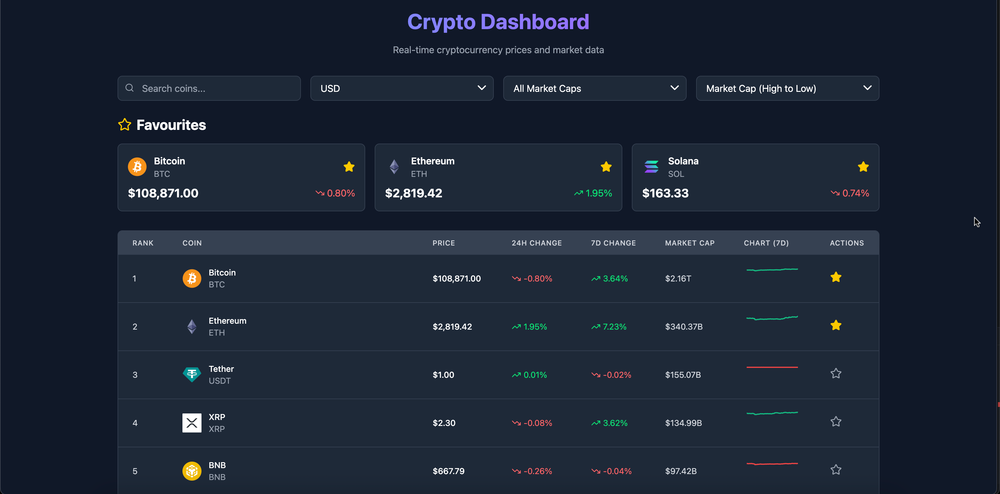
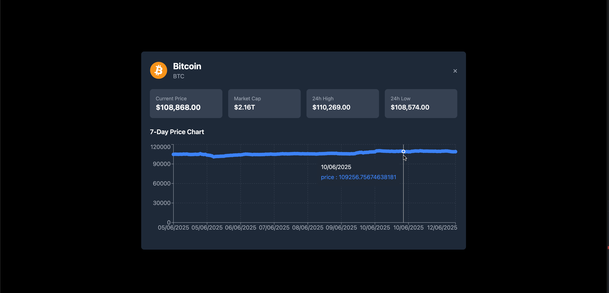

# 🪙 Crypto-Dashboard

A live cryptocurrency price tracker built with React. View real-time market data, filter by market cap, track your favorite coins, and analyze 7-day price trends with interactive charts.

---

## 🚀 Features

- 🔄 Live Price Updates from [CoinGecko API](https://www.coingecko.com/en/api)

- 📊 7-Day Price Charts using recharts

- 🌍 Currency Conversion (USD, INR, EUR, ...)

- ⭐ Favorite Coins stored in localStorage

- 📉 Market Cap Filters
  - All coins
  - Large Cap (>$10B)
  - Middle Cap ($1-10B)
  - Small cap (<$1B)

- 🌙 Clean, Dark UI with TailwindCSS

---

## 📦 Tech Stack

- ⚛️ React (Vite)

- 💨 Tailwind CSS

- 📈 recharts

-  Lucide React

- 🧠 LocalStorage (to persist favorites)

---

## 🔧 Installation

```bash
git clone https://github.com/Dhruvv7115/Crypto-Dashboard.git

cd crypto-dashboard

npm install

npm run dev
```
Open http://localhost:5173 in your browser.

---

## 📁 Project Structure

```bash 
src/
├── App.jsx         # Main app logic and UI
├── index.css       # Tailwind base styles
└── main.jsx        # Entry point
```

---

## 📈 API Source

All data is fetched from the CoinGecko API. No API key required for public endpoints.

---

## 📸 Screenshots

### Dashboard



### Chart View



## ✨ Future Improvements

- ✅ Include more timeframes (1d, 30d, 90d)

- 🔒 Backend auth + saved preferences

- Add ☀️Light/🌙Dark Mode toggle

## Live Link

#### **https://crypto-dashboard-vert-delta.vercel.app/**